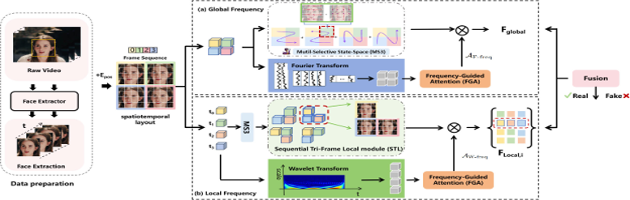
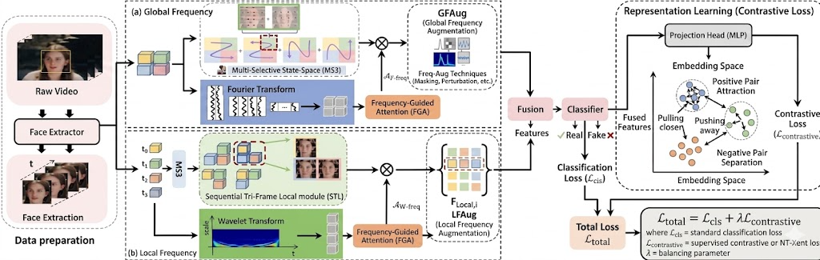

# DFSL++: Frequency-Guided Spatiotemporal Deepfake Detection with Contrastive Learning and Frequency Augmentation

## M.Tech Project Submission

### Authors

* **Dhairya Patel** — 202511054
* **Dhara Bambhroliya** — 202511057

---

# Abstract

This project presents an enhanced deepfake video detection framework based on the IEEE paper:

> *Dual Frequency-guided Spatiotemporal Feature Learning for Face Forgery Detection (DFSL)*

The original DFSL framework combines spatiotemporal learning and frequency-domain analysis using a dual-branch architecture consisting of:

* Fourier Transform
* Wavelet Transform
* Multi-Selective State-Space (MS3)
* Sequential Tri-frame Local (STL)
* Frequency Guided Attention (FGA)

to detect forged facial videos.

In this work, we extend DFSL using:

1. **Supervised Contrastive Learning**
2. **Frequency-Domain Augmentation**

The proposed enhancements significantly improve:

* cross-dataset generalization
* embedding discrimination
* robustness against unseen manipulations
* spectral representation learning

without increasing inference-time complexity.

---

# 1. Problem Statement

Modern generative AI models such as:

* GANs
* Diffusion Models
* Face Swapping Frameworks

can generate highly realistic forged videos that are difficult to distinguish from genuine content.

Existing deepfake detection methods suffer from:

* overfitting to dataset-specific artefacts
* weak cross-dataset performance
* poor robustness against unseen manipulations
* inability to learn generalized forgery representations

The objective of this project is to design a robust frequency-guided spatiotemporal deepfake detection framework capable of improving cross-domain generalization while maintaining high detection accuracy.

---

# 2. Motivation

The rapid advancement of generative AI has created a growing gap between:

* deepfake generation
* deepfake detection

Traditional detection approaches focus mainly on:

* spatial features
* temporal inconsistencies

but often fail to capture:

* spectral artefacts
* frequency-domain anomalies
* generalized manipulation patterns

The DFSL framework addresses this by integrating:

* spatiotemporal learning
* Fourier-domain analysis
* wavelet-based frequency learning

However, the original DFSL still suffers from:

* embedding overlap between real and fake samples
* sensitivity to dataset-specific frequency patterns
* reduced cross-dataset generalization

To overcome these limitations, we introduce:

* contrastive embedding learning
* frequency-domain augmentation

to improve robustness and spectral invariance.

---

# 3. Base DFSL Architecture

## DFSL Network Overview

<p align="center">
  
</p>

The original DFSL framework consists of two complementary branches:

## Global Branch

Captures:

* global spatial inconsistencies
* large-scale temporal distortions
* high-frequency structural artefacts

using:

* Multi-Selective State-Space (MS3)
* Fourier Transform
* Frequency Guided Attention (FGA)

## Local Branch

Captures:

* local texture artefacts
* frame-level inconsistencies
* subtle temporal relationships

using:

* Sequential Tri-frame Local (STL)
* Wavelet Transform
* FGA

Both branches are fused using adaptive weighted fusion for final classification.

---

# 4. Proposed DFSL++ Architecture

## Proposed Enhancement Pipeline

<p align="center">
  
</p>
The proposed framework extends DFSL using:

* Frequency Augmentation
* Contrastive Learning


without modifying inference-time architecture.

---

# 5. Proposed Enhancements

## 5.1 Supervised Contrastive Learning

A supervised contrastive loss is integrated after the DFSL fusion layer.

### Objectives

* Improve embedding separability
* Reduce overlap between real and fake representations
* Increase intra-class compactness
* Improve inter-class separation
* Enhance cross-dataset generalization

### Modified Loss Function


L_{total}
=========

L_{CE}
+
L_{GIL}
+
L_{LIL}
+
L_{contrast}


---

## 5.2 Frequency-Domain Augmentation

To improve spectral robustness, the following augmentation techniques are introduced:

### Fourier Amplitude Mixing

Mixes amplitude spectra between samples to reduce domain-specific bias.

### Random Frequency Dropout

Randomly removes selected frequency bands during training.

### Frequency Masking

Masks regions of frequency spectrum to encourage invariant feature learning.

### Advantages

* Prevents overfitting
* Improves spectral generalization
* Reduces dependence on dataset-specific artefacts
* Enhances robustness against unseen manipulations

---

# 6. Dataset Used

## FaceForensics++ (FF++)

Official GitHub Repository:

[FaceForensics++ GitHub Repository](https://github.com/ondyari/FaceForensics?utm_source=chatgpt.com)

Includes:

* DeepFake
* FaceSwap
* Face2Face
* NeuralTextures

Used for:

* model training
* intra-dataset evaluation

---

## CelebDF

Official GitHub Repository:

[CelebDF GitHub Repository](https://github.com/yuezunli/celeb-deepfakeforensics?utm_source=chatgpt.com)

Dataset characteristics:

* high-quality celebrity deepfakes
* realistic manipulations
* strong benchmark for generalization testing

---

## WildDeepfake (WDF)

Hugging Face Dataset Link:

[WildDeepfake Dataset on Hugging Face](https://huggingface.co/datasets/JWLiang007/WildDeepfake?utm_source=chatgpt.com)

Dataset characteristics:

* unconstrained real-world deepfakes
* varied scenes and lighting conditions
* diverse manipulation styles

---

# 7. Experimental Setup

## Frameworks and Libraries

* Python 3.10
* PyTorch
* PyTorch Lightning / Lightning AI
* CUDA

## Hardware

* NVIDIA GPU
* CUDA-enabled environment

## Training Configuration

| Parameter           | Value            |
| ------------------- | ---------------- |
| Optimizer           | Adam             |
| Learning Rate       | 1.5e-4           |
| Batch Size          | 4                |
| Scheduler           | Cosine Annealing |
| Epochs              | 50               |
| Embedding Dimension | 128              |

---

# 8. Experimental Results

## Baseline DFSL Results

| Dataset | Accuracy | AUC    |
| ------- | -------- | ------ |
| FF++    | 92.57%   | 96.73% |
| CelebDF | 71.53%   | 81.28% |
| WDF     | 72.12%   | 84.28% |

---

## Proposed DFSL++ Results

| Dataset | Accuracy | AUC    |
| ------- | -------- | ------ |
| FF++    | 91.84%   | 97.54% |
| CelebDF | 79.41%   | 90.84% |
| WDF     | 80.27%   | 92.11% |

---

# 9. Key Improvements

## Cross-Dataset Generalization

The proposed enhancements significantly improve performance on unseen datasets.

### AUC Improvements

* CelebDF: **+9.56%**
* WDF: **+7.83%**

## Embedding Learning

Contrastive learning:

* improves class separation
* reduces feature overlap
* enhances discriminative representation learning

## Spectral Robustness

Frequency augmentation:

* prevents overfitting
* improves invariance
* enhances robustness to spectral artefacts

---

# 10. Project Structure

```bash
project/
│
├── dataset/
├── models/
│   ├── dfsl/
│   ├── contrastive_head/
│
├── augmentation/
│   ├── frequency_masking.py
│   ├── frequency_dropout.py
│   ├── amplitude_mix.py
│
├── training/
│   ├── train.py
│   ├── lightning_module.py
│
├── evaluation/
│   ├── test.py
│   ├── metrics.py
│
├── figures/
│   ├── base_architecture.png
│   ├── proposed.png
│
├── report/
│   ├── ieee_report.pdf
│
├── requirements.txt
└── README.md
```

---

---

# 11. Future Work

Possible future extensions include:

* lightweight real-time deployment
* adversarial robustness
* multimodal deepfake detection
* transformer-based contrastive learning
* audio-visual forgery detection
* edge-device optimization

---

# 12. References

1. Junxian Duan et al.,
   *Dual Frequency-guided Spatiotemporal Feature Learning for Face Forgery Detection*, IEEE TBIOM, 2026.

2. Khosla et al.,
   *Supervised Contrastive Learning*, NeurIPS 2020.

3. Rossler et al.,
   *FaceForensics++*, ICCV 2019.

4. Li et al.,
   *Celeb-DF Dataset*, CVPR 2020.

---

# 13. Conclusion

This project enhances the DFSL framework using:

* supervised contrastive learning
* frequency-domain augmentation

The proposed DFSL++ framework achieves:

* improved cross-dataset robustness
* stronger embedding discrimination
* better unseen forgery detection
* enhanced spectral representation learning

while preserving the efficiency of the original DFSL architecture.
